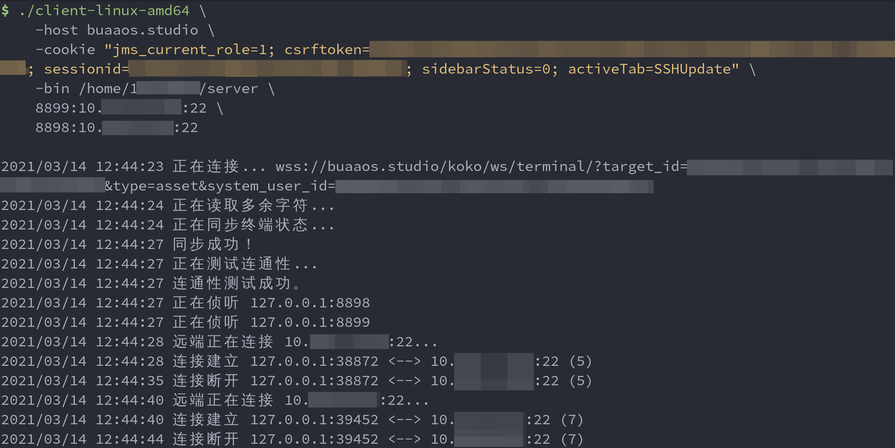

# OS Lab Proxy
让你无需服务器即可愉快写 OS Lab，并直接使用本地 git 提交，无需手动向服务器传文件。

修改自 [t123yh/educg-proxy](https://github.com/t123yh/educg-proxy) 项目，适用于当前的 JumpServer 系统。

## 使用方法
1. 在 Release 页面下载 server 和本地平台对应的 client 程序。
2. 在 Web 界面中将 server 文件上传到实验平台。
3. 使用下面说明的参数在本地启动 client 程序。
4. 将实验平台上的 `~/.ssh/id_rsa` 复制到本地，并将其设置为仓库 git ssh 的私钥。如果不想直接替换本地的私钥，可以使用 ssh-agent 或编辑 `~/.ssh/config`。
5. 在本地使用 `git init` 命令创建一个空的仓库，并使用 `git remote` 命令将你映射的本地地址添加为上游地址。参考的上游地址格式为 `ssh://git@127.0.0.1:<本地端口>/19373xxx-lab`。最后使用 `git pull` 拉取仓库内容。
6. 在本地提交修改后，使用 `git push` 推送即可。

## 注意事项

* 使用完后，请在本地按 Ctrl+C 退出程序。退出程序时，可以看到 server 会 panic，是正常现象。

## client 程序参数
`./client -host <JumpServer 地址> -cookie <JumpServer 网页 Cookie> -bin <server 文件路径> <映射 1> [<映射 2> ...]`

其中：
* `JumpServer 地址`：例如 `buaaos.studio` 或 `https://d.buaa.edu.cn/https/77726476706e69737468656265737421f2e2409d282326436a1d8da597` 。
* `JumpServer 网页 Cookie`：格式形如 `"csrftoken=****; sessionid=****"`，需要放在双引号中。在浏览器中访问 JumpServer 网页，登录后按 F12 打开开发者工具，在 Console 中执行 `document.cookie` 即可查询。若结果中不存在 csrftoken 或 sessionid，可在浏览器的网站设置中查询。
* `server 文件路径` 是实验平台上你的 server 文件存放位置，如 `/home/19373xxx/server`。如果没有指定，则默认为 `/home/jovyan/server`。请避免该路径中含有空格。
* `映射 n` 是你自定义的映射规则，格式为 `<本地端口>:<远程 IP>:<远程端口>`。例如，如果希望在本地 127.0.0.1 的 8899 端口通过实验平台访问 192.168.12.34 的 22 端口，则可以写 `8899:192.168.12.34:22`。注意请根据仓库服务器的实际地址填写远程 IP，否则无法连接。仓库服务器的实际地址可在仓库内使用 `git remote` 命令查看；如果只知道仓库服务器的域名，可以在实验平台上使用 ping 获取其 IP。git 使用 ssh 协议，远程端口号一般都是 22。若要连接到实验平台本身（如传输文件），需要使用实验平台的内网 IP，可通过 JumpServer 网页或 `ip addr` 命令查看。

## 正常运行演示

## MIPS 编译器及 gxemul 下载
~~https://seafile.h.t123yh.xyz:3/f/11083adb98d24354a9e2/~~

~~https://seafile.h.t123yh.xyz:3/f/c361b230647345d9a1c8/~~

https://drive.google.com/file/d/10eK6srq6FvIJJIwMUmy4SMXM0p3h1asA/view

## Hints

- 若实验平台不支持上传文件，可将 Releases 中提供的 `server.txz.b64.txt` 内的文本复制到 ssh 里的编辑器（`cat >file` 或 `vim` 等）中保存，再使用命令 `base64 -d server.txz.b64.txt | tar xJv` 解码。

- 若需要从网络中的其他设备连接到 client，可添加参数 `-bind 0.0.0.0`，并在使用时将本地 IP `127.0.0.1` 替换为运行 client 的设备的 IP。

- 若使用免客户端 VPN（[d.buaa.edu.cn](https://d.buaa.edu.cn)），需要在 Cookie 中附加 VPN 所需的 Cookie，并在 `-qs` 参数中提供额外的 query string。
